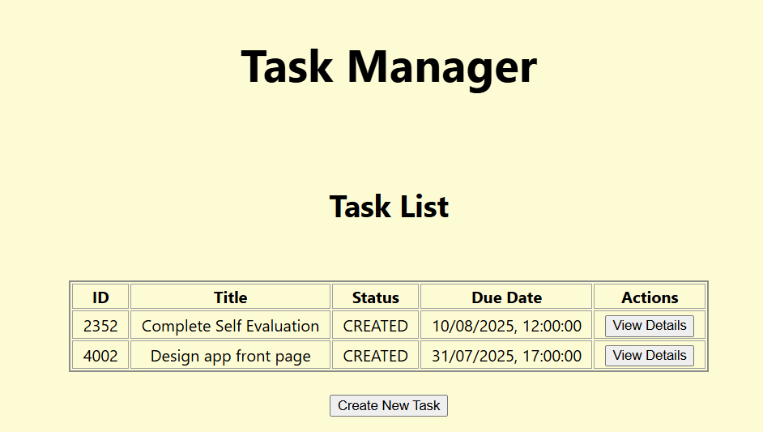
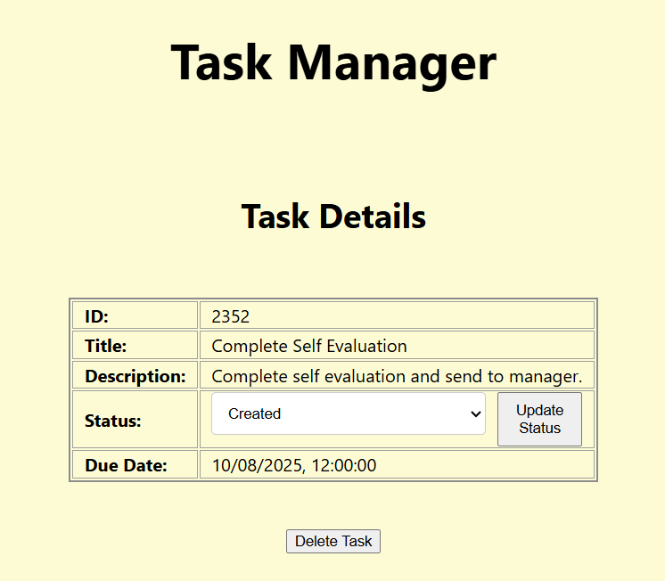
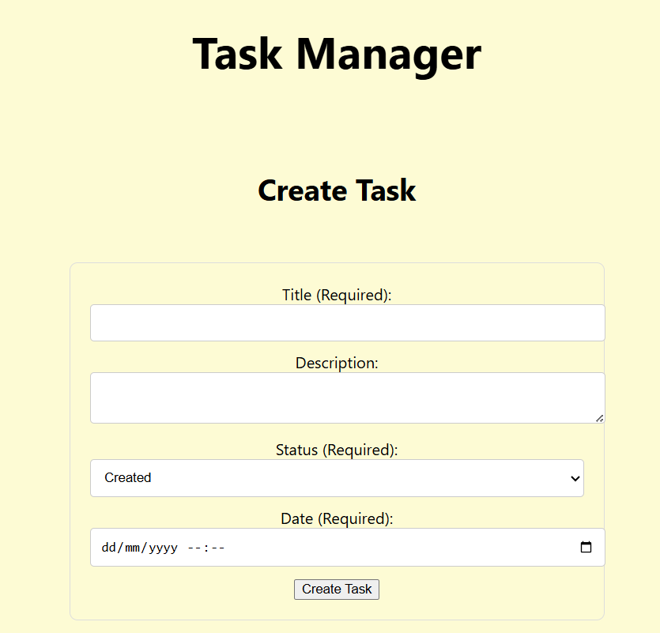

# Task List Frontend
Frontend part of submission for challenge described here here: https://github.com/hmcts/dts-developer-challenge. The backend service can be found here: https://github.com/JonathanJ00/task-list-backend.

## Start Guide
This service can be started by running the below command in the root directory.
~~~
npm start
~~~

## User Guide

### General
- When running the application can be accessed at http://localhost:3000/.
- To return to the home page at any point click on the heading which reads Task Manager.

### Home Page

- The Home Page displays details about all existing tasks.
- Press the View Details button next to any task to open the details page for that task.
- Press the Create New Task button to open a form allowing you to create a new task.

### Task Details Page

- The Task Details Page shows the details of a specific task.
- To delete the task press the Delete Task button.
- To update the tasks status:
    - Select a new status from the dropdown list.
    - Press the Update Status button.

### Create Task Page

- The Create Task Page allows a user to create a new task.
- To create a task fill in the details and press the Create Task button.
- The Title, Status and Date fields are required fields.
